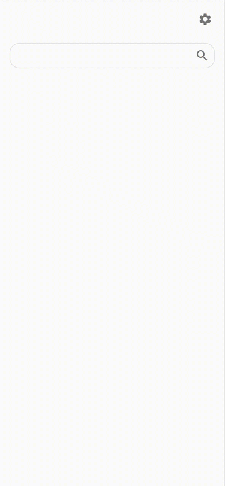

## Start node server
#### (Optoin 1). Run app from console
1. Copy [.env.sample](.env.sample) as `.env` and edit the environment variables in the file

2. Build
```
npm install
npm run build
```

3. Run
```
npm run start
```

#### (Optoin 2). Run app using Docker
1. Copy [.env.sample](.env.sample) as `.env` and edit the environment variables in the file

2. Build a Docker image
```
docker build -f Dockerfile -t wex-qdoc-ui:latest .
```

3. Run
```
docker run -it -p 3000:3000 wex-qdoc-ui:latest
```

#### (Option 3). Run app from Visual Studio Code
1. Open your local repository with Visual Studio Code
1. Copy [.env.sample](.env.sample) as `.env` and edit the environment variables in the file
1. Select **Debug** -> **Start Debugging**


## Play with app
1. Open http://localhost:3000/wex
1. Open the settings and select a collection and fields
1. Input a query, then click search


